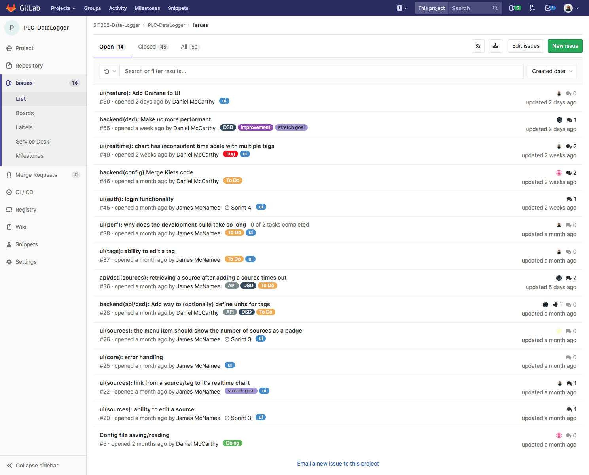
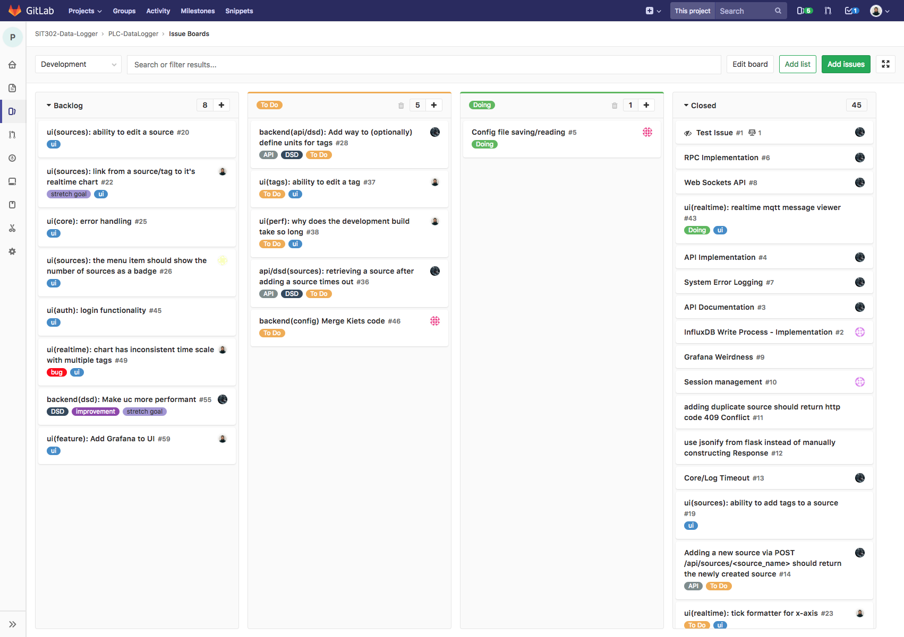
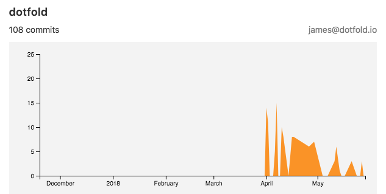

### Assertion

My primary focus on this project was to lead and implement the user interface development which functions to administer data sources (PLCs) and provide a view of realtime graph data.

Because I have fairly extensive professional experience, and am currently employed full time as a Software Engineer I was tasked with leading the frontend team. I was also able to offer advice and assistance to team members in the other teams based on my prior experience working with similar architectures and technologies.

Since the project did not have any existing UI I was able to decide on the technology stack to be used, and how the project would be structured.

I have very particular preferences when it comes to certain aspects of software development, and I put these into place on this project as well. These include the folder structure for source code, code style standards, and git commit message format, as well as my preference for lightweight issue/task management.

In the previous unit, the team had used Trello for issue management, but I recommended a switch to using the issue management feature provided with GitLab. This reduces context switching and enables other features like closing issues via git commit or merge, which is a productivity enhancement.

We used GitLab issues for task management:

GitLab provides a Kanban style issue board:

My first task was to setup the project for a containerized environment, which would allow the team to focus on forward development, and not having to spend inordinate amounts of time on environment setup. It's also how we had planned to deliver the end product as well, and I firmly believe in tackling this aspect up front on any project. Unfortunately due to lack of experience with docker and containerization concepts in the group, there was still more time lost than expected on setup, but myself and Daniel were able to help out to bring everyone up to speed.

Once deployment and runtime environment concerns had been addressed, I moved onto UI development.

I already had a good idea of how to get a boilerplate in place quickly, that would allow me to focus on the core feature development. I chose to use React since that is the JavaScript view framwork I work in every day. This would enable me to move quickly, and again, focus on the business logic rather than the intricacies of implementation.

The end result can be seen both on the [project page](/project) and the source code is public on [GitLab](https://gitlab.com/SIT302-Data-Logger/PLC-DataLogger). In the end, I solely implemented nearly all of the UI:

* Layout and initial styling
* Source and tag configuration
* API data fetching and parsing
* Realtime data connection to mqtt
* Realtime data graph

My contribution graph from the GitLab source code repository:

Source: [GitLab Repository →](https://gitlab.com/SIT302-Data-Logger/PLC-DataLogger/graphs/master)
