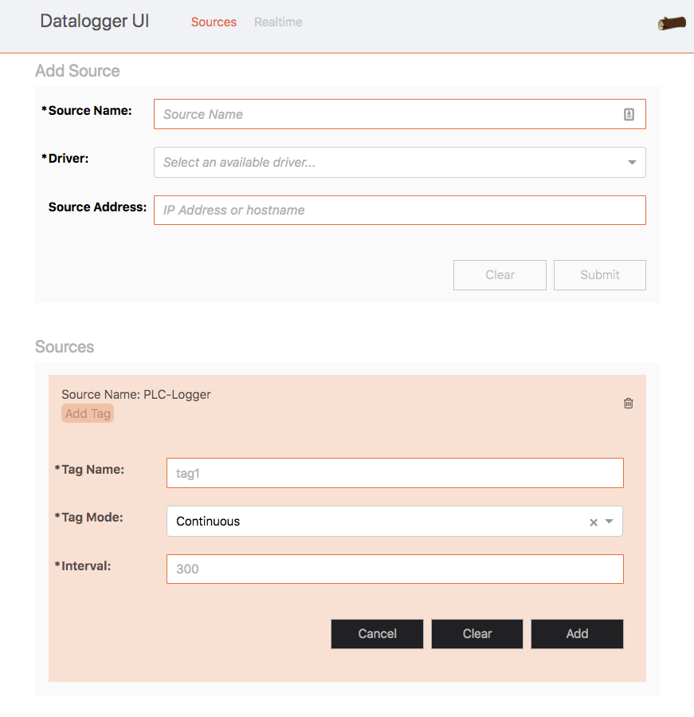

### AKD Softwoods - Datalogger

#### Project Description

Our client, AKD Softwoods uses Programmable Logic Controllers (PLCs) in their machinery, which captures and holds valuable information about the state of the machinery. This information is valuable because it can enable engineers to diagnose faults and inefficiencies.

Our project aim was to deliver a system that could add connections to PLCs and set data points (tags) to log at either a defined time interval, or on a "change" event (i.e. when the data point changes from the previous value).

The primary goal of this system is to be able to accept timeseries data in as close to realtime as possible, and make that data available via a web user interface.

#### Project Deliverable

The requirement to be able to accept data from a range of PLC hardware meant that the system design had to be flexible. This was accomplished by using a common driver interface, that defines ingress points and data communication protocols. The data is fed into a message queue, which is primarily to allow the influxDB instance to pull the data for persistence. The message queue approach also allows the UI to connect to the data stream for realtime charting.

The administration interface is a typical client-server architecture backed by a RESTful API. The client is a Single Page Application written from scratch primarily using React, a modern view framework for JavaScript.

Because the system is designed with a microservice approach, each piece is containerized and orchestrated using docker-compose.

#### Project Team Structure

**Divided into three groups:**

* Frontend
* Backend
* Testing/Documentation

#### My Role

* Frontend Team Lead
* Frontend / UI Development
* Containerization with Docker
* Project Management - issues and task boards
* Report writing and review

#### My Key Deliverables

* Develop UI according to requirements and wireframes
* Technology stack
* Define project structure
* Implementation of UI elements, async communications to the RESTful API, realtime graph components

`youtube:https://www.youtube.com/embed/muaVpYR2fVM`
